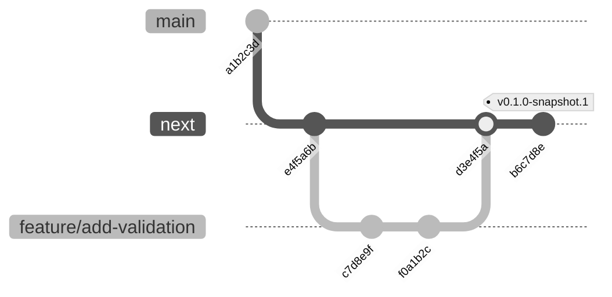
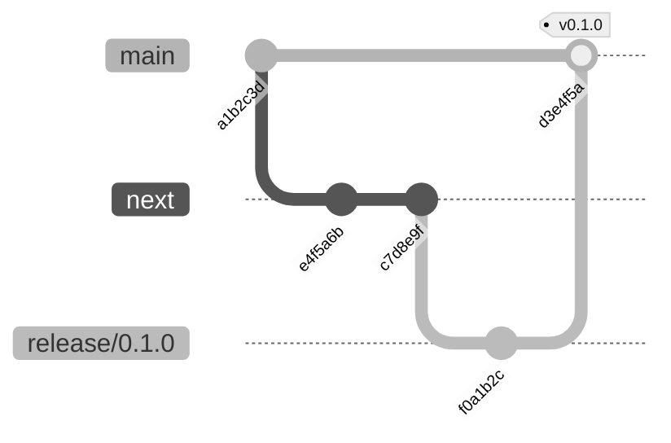

# Contribution Guide

We welcome your contributions to the [@leandromatos/commitlint-config](https://github.com/leandromatos/commitlint-config) project! This guide details the contribution process.

## Getting Started

To start, clone the repository and install the dependencies:

```bash
yarn install
```

## Code Style

- We use [ESlint](https://eslint.org/) and [Prettier](https://prettier.io/) to enforce a consistent code style. The repository includes the configuration for code style through the [@leandromatos/eslint-config](https://github.com/leandromatos/eslint-config) package.
- The code is automatically linted before each commit. If there are any linting errors, the commit will fail.
- You can also run `yarn lint` to lint the code manually or `yarn lint:fix` to automatically fix any linting errors.

## Commit Message Conventions

Our commit messages follow the Conventional Commits specification to standardize our history.

- All commit messages must adhere to the [@leandromatos/commitlint-config](https://github.com/leandromatos/commitlint-config) format.
- Common types include: `build`, `chore`, `ci`, `docs`, `feat`, `fix`, `perf`, `refactor`, `revert`, `style`, `test`.
- The message should be structured as: `<type>[optional scope]: <description>`.
- The description should be written in the imperative, present tense: "add" not "added" nor "adds".
- The description should not include a period (.) at the end.
- The description need to start with a capital letter.

### Examples

```bash
# Make a change that affects the build system or external dependencies, like update dependencies
git commit -m "build: Update dependencies"

# Make a change that does not affect the meaning of the code
git commit -m "chore: Update .gitignore"

# Create a new release version
git commit -m "chore(release): v0.1.0"

# Create a new snapshot version
git commit -m "chore(release): v0.0.0-snapshot.20250325.1"

# Make a change that affects the continuous integration system
git commit -m "ci: Add new CI workflow"

# Add or correct documentation
git commit -m "docs: Add new documentation"

# Add a new feature
git commit -m "feat: Add new feature"

# Fix a bug
git commit -m "fix: Correct typo"

# Improve performance
git commit -m "perf: Improve performance"

# Refactor the code
git commit -m "refactor: Change variable name"

# Revert a previous commit
git commit -m "revert: Revert previous commit"

# Make a change that does not affect the meaning of the code
git commit -m "style: Correct indentation"

# Add or correct tests
git commit -m "test: Add new test"
```

## Branching Strategy

We follow a modified Git Flow with the following branches:

- `main`: Stable production branch containing the latest released version.
- `next`: Development branch for new features and snapshot versions.
- `release/*`: Stabilization branches created from `next` for preparing upcoming releases.
- `feature/*`: Feature branches created from `next` for new features or fixes.

### Snapshot Versioning (Next Branch)

- The `next` branch is the main development branch, used for integrating features and creating snapshot versions.
- Feature branches are created from `next` and merged back into `next` using the squash merge strategy.



### Stable Versioning (Main Branch)

- When `next` is ready for a release, a `release/*` branch is created from `next` for stabilization.
- Only bug fixes go into `release/*` via feature branches during stabilization.
- Once stable, `release/*` is merged into `main` using the rebase merge strategy.



### Generic Steps

1. Create a feature branch from `next`.
2. Commit changes following the conventional commit format.
3. Open a pull request from your feature branch to `next`.
4. Merge using the squash merge strategy.
5. When ready for release, create a `release/*` branch from `next`.
6. Apply bug fixes to `release/*` via feature branches (squash merge).
7. Merge `release/*` into `main` using the rebase merge strategy.
8. Delete the `release/*` branch after merging.

## Versioning and Releases

We follow [Semantic Versioning](https://semver.org/) for versioning. Releases are managed locally using [commit-and-tag-version](https://github.com/absolute-version/commit-and-tag-version), which analyzes conventional commits, bumps the version in `package.json`, generates `CHANGELOG.md`, creates a commit and a git tag.

### Release Scripts

| Script | Description |
| --- | --- |
| `yarn release:snapshot` | Generate a snapshot version on `next` |
| `yarn release` | Automatic bump (patch/minor/major) based on conventional commits |
| `yarn release:patch` | Force a patch version bump |
| `yarn release:minor` | Force a minor version bump |
| `yarn release:major` | Force a major version bump |

> [!NOTE]
> For the very first release of a new project (no prior tags), use `yarn release --release-as 0.1.0` to create the initial version.

### Stable Release (Main Branch)

1. Switch to the `main` branch:

    ```bash
    git checkout main
    ```

2. Run the release script:

    ```bash
    yarn release
    ```

3. Push the commit and tag to the remote repository:

    ```bash
    git push --follow-tags
    ```

The CI/CD pipeline will automatically publish the package to NPM when a `v*` tag is pushed.

### Snapshot Release (Next Branch)

1. Switch to the `next` branch:

    ```bash
    git checkout next
    ```

2. Run the snapshot script:

    ```bash
    yarn release:snapshot
    ```

    > [!NOTE]
    > The `release:snapshot` script is a bash script. If you encounter permission issues, run `chmod +x ./scripts/snapshot-version-bump.sh`.

3. Commit and tag the new version:

    ```bash
    git add --all
    git commit -m "chore(release): v<NEW_VERSION>"
    git tag -a v<NEW_VERSION> -m "chore(release): v<NEW_VERSION>"
    ```

    > [!IMPORTANT]
    > Always use `git tag -a` (annotated tag) instead of `git tag` (lightweight tag). Annotated tags store author, date, and message, and are the only tags pushed by `--follow-tags`.

4. Push to the remote repository:

    ```bash
    git push --follow-tags
    ```

    > [!TIP]
    > The `--follow-tags` flag only pushes annotated tags that reference commits being pushed. This prevents accidentally pushing unrelated tags, unlike `--tags` which pushes all local tags.

A snapshot version will only be published if the tag is pushed to the `next` branch.

## Testing

- We use [Vitest](https://vitest.dev/) for testing.
- Run `yarn test` to run the tests.
- Run `yarn test:watch` to run the tests in watch mode.
- Run `yarn test:cov` to run the tests and generate the coverage report.

## Community Guidelines

- Be respectful and considerate in discussions.
- Contributions are expected to adhere to our code of conduct.
